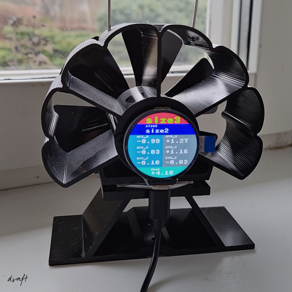

# Stove Temperature
**NOTE** *This is early in development and not yet working as planned*

A modified version of an ordinary stove fan, where the thermoelectric generator
is also powering a display and a microcontroller showing the temperature of the
stove.

I'll put it on the back, so the fan kan be kept, but will have to change the rotation direction of the fan. Also attaching magnets, so it can be placed vertically on the side of the stove. Built-in accelerator/gyroscope should automatically rotate the screen.

Historical values can be extracted via a QR-code on the display
(if memory is enough).

## Setup

### Hardware
* Microcontroller + display: [RP2040-LCD-1.28](https://www.waveshare.com/wiki/RP2040-LCD-1.28)
* Temperature sensor(s): DS18B20 (-55°C till 125°C)

### Software
Libraries:
* https://www.waveshare.com/wiki/RP2040-LCD-1.28
* https://github.com/JASchilz/uQR

Install MicroPython on the microcontroller. The display didn't work using official MicroPython `1.24.1`, had to
use the bundled `rp2-pico-20220117-v1.18.uf2`.

## Historical data
1. Do action X to bring up the QR-code and scan
2. Input string to script Y to format it into a csv-file
